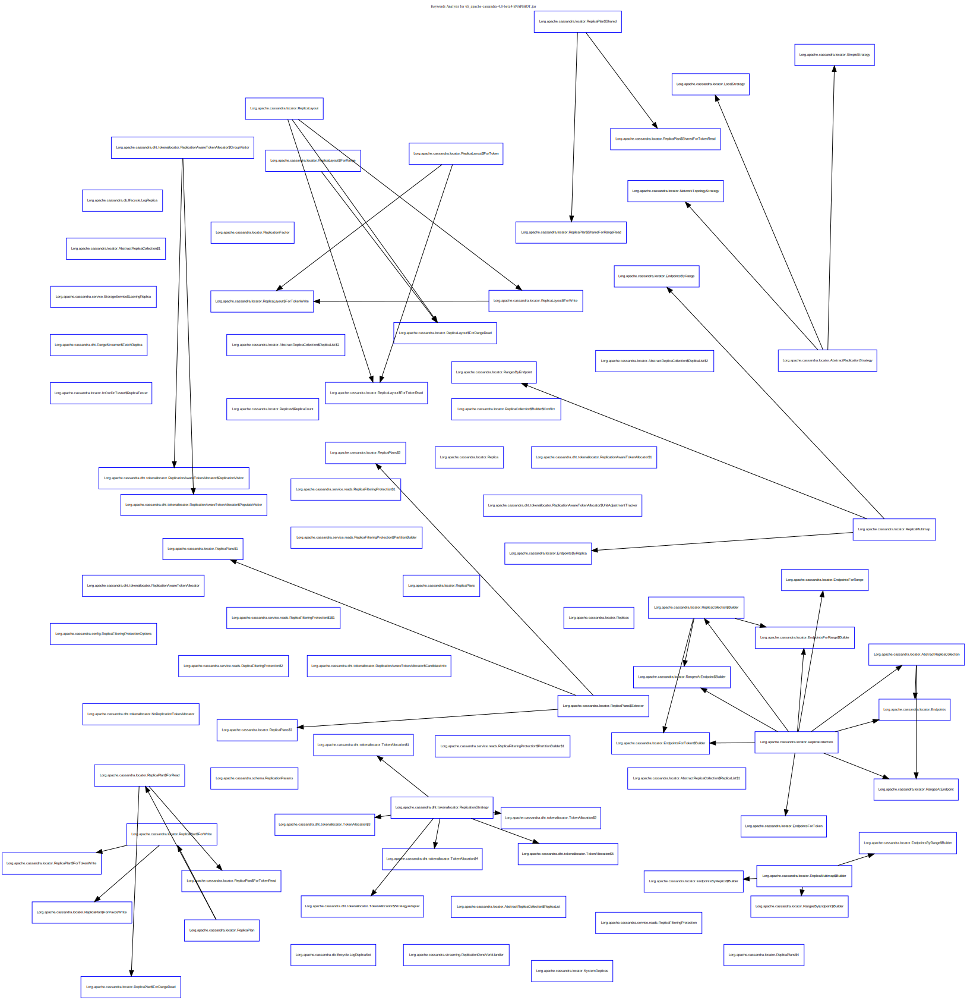
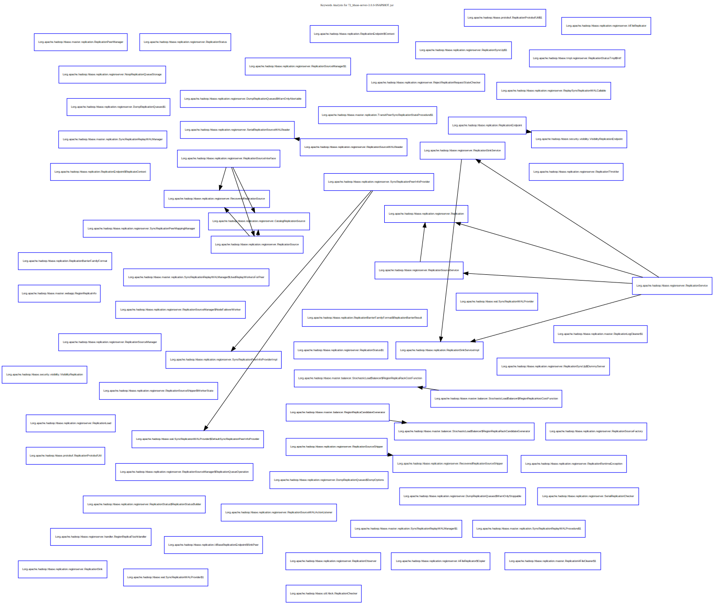

# 服务计算基础第四次作业

## 使用WALA进行静态分析

使用`scala`调用`WALA`工具, 统计[`cassandra`](./cassandra) 和 [`hbase`](./hbase)中含有`Replica`和`Replication`这两个关键字的类的数量，并分析调用关系。

### 复现方法

1. 编译`cassandra` 和 `hbase`, 并准备后续分析需要使用的文件。

```bash
# 创建临时目录
mkdir $ASSIGNMENT4/jars

# 编译cassandra
cd $ASSIGNMENT4/cassandra
ant build

# 编译hbase
cd $ASSIGNMENT4/hbase
mvn package -DskipTests

bash $ASSIGNMENT4/gather.sh
```

2. 运行测试

```bash
sbt

sbt> compile
sbt> run -i ./jars -o ./results
```

> 注意, 测试结果的命名方式为`WALA_<Counts>_<JAR_NAME>.<SUFFIX>`. 其中`Counts`表示带有`Replica`和`Replication`这两个关键字的类的数量.

3. 使用`graphviz`引擎生成调用图

```bash
bash $ASSIGNMENT4/post_process_results.sh
```


### 部分结果

cassandra 分析结果



hbase-server 分析结果



## 使用LLVM进行符号分析和测试用例生成

## 使用`JAVA Assist`机制测试MapReduce程序


