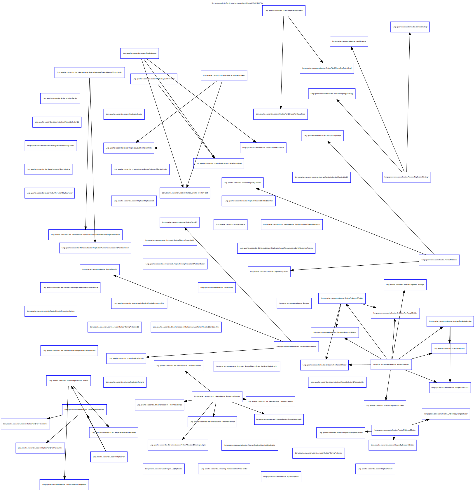
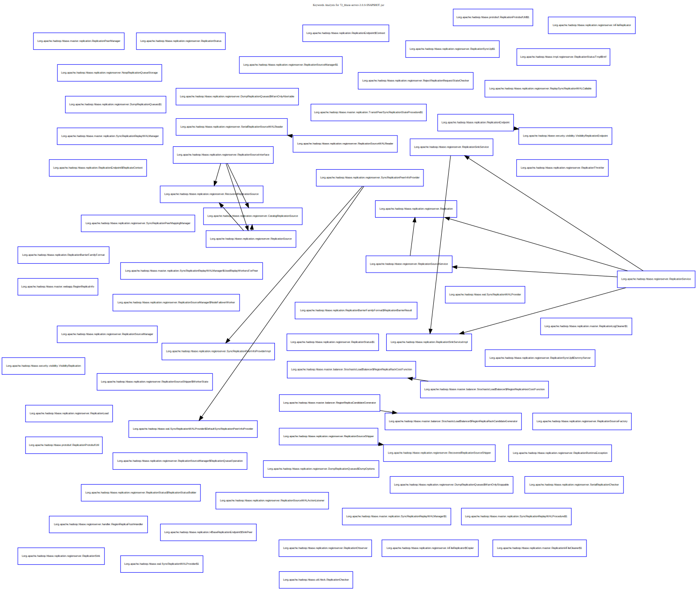
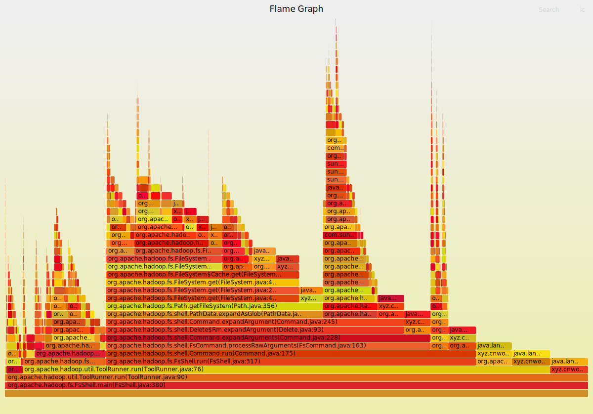

# 服务计算基础第四次作业

## 使用 WALA 进行静态分析

使用`scala`调用[WALA]工具, 统计[Cassandra] 和 [HBase]中含有`Replica`和`Replication`这两个关键字的类的数量，并分析调用关系。 
这部分代码参见[static-wala](./static-wala)。

### 复现方法

1. 编译[Cassandra] 和 [HBase], 并准备后续分析需要使用的文件。

```bash
# 创建临时目录
mkdir $ASSIGNMENT4/jars
# 编译cassandra
cd $ASSIGNMENT4/cassandra
ant build
# 编译hbase
cd $ASSIGNMENT4/hbase
mvn package -DskipTests
bash $ASSIGNMENT4/gather.sh
```

2. 运行测试

```bash
sbt
sbt> compile
sbt> run -i ./jars -o ./results
```

> 注意, 测试结果的命名方式为`WALA_<Counts>_<JAR_NAME>.<SUFFIX>`. 其中`Counts`表示带有`Replica`和`Replication`这两个关键字的类的数量.

3. 使用[GraphViz]引擎生成调用图

```bash
bash $ASSIGNMENT4/post_process_results.sh
```

### 部分结果

[Cassandra]分析结果



[HBase]分析结果(hbase-server 组件)



## 使用 LLVM 进行符号分析和测试用例生成

使用[KLEE]工具进行符号分析，并生成自动化测试用例。
这部分代码参见[static-klee](./static-klee)

### 复现方法

```
cd static-klee
docker build -t sc/klee .
docker run -v $(pwd)/sample:/home/klee/sample/ -it --rm --name sc_klee  sc/klee

#attach to docker container's shell
> cd /home/klee/sample
> make
```

执行完上述 make 指令后, 将在本地目录生成测试用例文件。

## 使用`JAVA Assist`机制测试 MapReduce 程序

使用[JavaAssist]工具配合 JVM 的`JAVA Agent`机制, 对`MapReduce`程序进行动态分析。 
这部分代码参见[dynamic-agent](./dynamic-agent)

### 复现方法

1. 准备基于Docker的MapReduce环境, 具体过程参见我的另一个[仓库](https://github.com/CNLHC/mapreduce-introduction)(本科<大数据计算>课程大作业)
2. 使用sbt编译Agent Jar包, 并复制到容器内.

```
cd assignment4/dynamic-agent
sbt
> assembly
> exit

#拷贝agent文件
docker cp ./target/scala-2.12/sc_buaa_profiler.jar hadoop:/root/
```

3. 使用`hadoop`程序提交Mapreduce作业, 并通过设置环境变量`HADOOP_OPTS='-javaagent:/root/sc_buaa_profiler.jar'`实现加载自定义的JAVA Agent.

### 部分结果

在设计分析代码时，我将调用栈折叠成[FlameGraph]兼容的格式，并绘制出`Hadoop`运行过程中的火焰图。所有线程的火焰图参见[这里](./dynamic-agent/out)

> 火焰图命名格式为 ${TID}.flametrace.svg , TID 表示线程 ID

主线程运行结果(可点击[此处](https://raw.githubusercontent.com/CNLHC/service_computing_2020/master/assignment4/dynamic-agent/out/1.flametrace.svg)查看交互式火焰图):



[WALA]: https://github.com/wala/WALA
[Cassandra]: https://cassandra.apache.org/
[HBase]: https://hbase.apache.org/
[KLEE]: https://klee.github.io/
[FlameGraph]: https://github.com/brendangregg/FlameGraph
[GraphViz]: https://graphviz.org/
[JavaAssist]:  https://github.com/jboss-javassist/javassist
